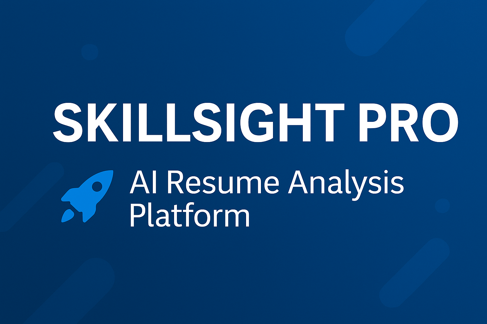

# SkillSight Pro — AI Resume Analysis Platform

SkillSight Pro is an AI-driven resume analysis system that combines **Deep Learning**, **NLP**, and **Large Language Models (LLMs)** to evaluate resumes, extract skills, compute job-match scores, and generate ATS-friendly insights.

It is open-source, easy to run, and helps students, job seekers, and developers understand and improve their resumes. 🚀🤖

---

<p align="center">
  <a href="#getting-started"></a>
  <a href="https://github.com/harikaguruju/AI-Resume-Analysis/archive/refs/heads/main.zip"></a>
  <a href="#screenshots"></a>
</p>

<p align="center">
  
</p>

---

## 🚀 Features

- **Skill Extraction (NER)** using BERT
- **Semantic Matching** using Sentence Transformer embeddings
- **LLM-Powered Analysis** (OpenRouter)
- **ATS & Job Match Score**
- **Resume Clarity Scoring**
- **Interactive Streamlit Dashboard**
- **Supports PDF, DOCX, TXT**

---
## 📸 Application Screenshots

### 🖼️ Screenshot 1  


### 🖼️ Screenshot 2  


### 🖼️ Screenshot 3  


### 🖼️ Screenshot 4  


### 🖼️ Screenshot 5  


## 📥 Getting Started

### Requirements
- Python 3.8+
- pip
- OpenRouter API key (for LLM features)

### Installation

```bash
git clone https://github.com/harikaguruju/AI-Resume-Analysis.git
cd AI-Resume-Analysis
pip install -r requirements.txt

